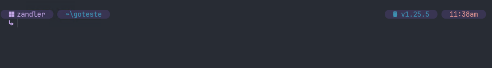
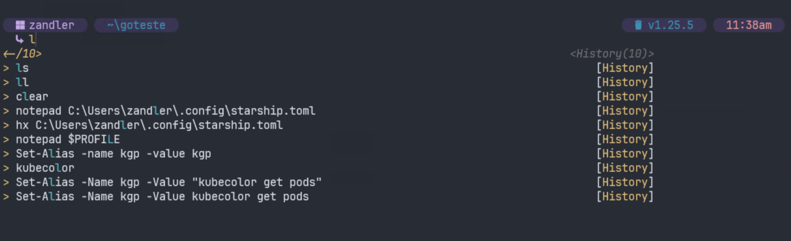
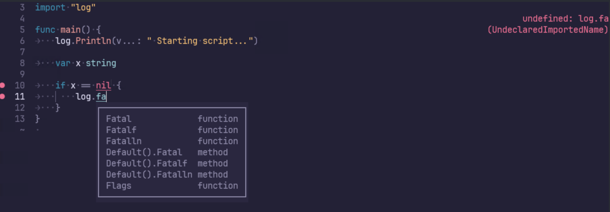

# DOTFILES

## Overview
This dotfiles repository provides a complete development environment setup for Ubuntu 22.04. It automates the installation and configuration of tools for:
- **Frontend**: NVM, Node.js, npm packages
- **Backend**: .NET, Python, Go
- **SRE/DevOps**: kubectl, terraform, ansible, AWS CLI, Docker

at final you will see this:


auto copmlete and predict (cof-cof)


syntax-highlight and complete 



## Requirements
- Ubuntu 22.04 (WSL or native)
- Git
- Internet connection

## Quick Install

**⚠️ Important**: You'll need to interact with the script for sudo password and some package confirmations.

```bash
sh -c "$(curl -fsSL https://raw.githubusercontent.com/Zandler/dotfiles/refs/heads/main/install.sh)"
```

### What the script does:
1. Validates Ubuntu environment
2. Clones this repository to `~/.dotfiles`
3. Executes bootstrap.sh for complete setup
4. Configures zsh with Oh My Zsh, plugins, and Starship prompt

## Manual Installation

```bash
git clone https://github.com/Zandler/dotfiles ~/.dotfiles
cd ~/.dotfiles
./bootstrap.sh
```

## Installed Tools

### Development Tools
- **Languages**: Node.js (via NVM), Python 3, .NET SDK, Go
- **Editors**: Vim, Helix
- **Version Control**: Git with custom configuration

### DevOps/SRE Tools
- **Container**: Docker, Docker Compose
- **Kubernetes**: kubectl, kubectx, k9s, helm
- **Infrastructure**: Terraform, Terragrunt, Ansible
- **Cloud**: AWS CLI
- **Monitoring**: htop, k6

### Terminal Enhancement
- **Shell**: Zsh with Oh My Zsh
- **Prompt**: Starship
- **File listing**: eza (modern ls replacement)
- **Plugins**: autosuggestions, syntax highlighting, autocomplete

## Aliases Reference

### File Operations
| Alias | Command | Description | Example |
|-------|---------|-------------|----------|
| `ls` | `eza -lbGd --header --git --sort=modified --color=always --group-directories-first --icons` | Enhanced file listing with icons and git status | `ls` |
| `ll` | `eza --tree --level=2 --color=always --group-directories-first --icons` | Tree view of directories (2 levels) | `ll` |

### Kubernetes - Get Resources
| Alias | Command | Description | Example |
|-------|---------|-------------|----------|
| `kgp` | `kubecolor get pods` | List all pods with colors | `kgp -n default` |
| `kgs` | `kubecolor get services` | List all services | `kgs --all-namespaces` |
| `kgd` | `kubecolor get deployments` | List all deployments | `kgd -o wide` |
| `kgn` | `kubecolor get nodes` | List all nodes | `kgn` |
| `kgi` | `kubecolor get ingress` | List all ingress resources | `kgi -n production` |
| `kgns` | `kubecolor get namespaces` | List all namespaces | `kgns` |

### Kubernetes - Delete Resources
| Alias | Command | Description | Example |
|-------|---------|-------------|----------|
| `kdp` | `kubecolor delete pod` | Delete a pod | `kdp my-pod-123` |
| `kdd` | `kubecolor delete deployment` | Delete a deployment | `kdd my-app` |
| `kds` | `kubecolor delete service` | Delete a service | `kds my-service` |
| `kdns` | `kubecolor delete namespace` | Delete a namespace | `kdns test-env` |
| `kdi` | `kubecolor delete ingress` | Delete an ingress | `kdi my-ingress` |

### Kubernetes - Describe Resources
| Alias | Command | Description | Example |
|-------|---------|-------------|----------|
| `kdsp` | `kubecolor describe pod` | Describe a pod | `kdsp my-pod-123` |
| `kdsd` | `kubecolor describe deployment` | Describe a deployment | `kdsd my-app` |
| `kdsn` | `kubecolor describe node` | Describe a node | `kdsn worker-node-1` |
| `kdss` | `kubecolor describe service` | Describe a service | `kdss my-service` |
| `kdsi` | `kubecolor describe ingress` | Describe an ingress | `kdsi my-ingress` |
| `kdnsd` | `kubecolor describe namespace` | Describe a namespace | `kdnsd production` |

### Kubernetes - Operations
| Alias | Command | Description | Example |
|-------|---------|-------------|----------|
| `kcr` | `kubecolor create -f` | Create resources from file | `kcr deployment.yaml` |
| `ked` | `kubecolor edit deployment` | Edit a deployment | `ked my-app` |
| `kep` | `kubecolor edit pod` | Edit a pod | `kep my-pod-123` |
| `krun` | `kubecolor run` | Run a pod | `krun test --image=nginx` |
| `kexec` | `kubecolor exec` | Execute command in pod | `kexec -it my-pod -- /bin/bash` |

## Configuration Files

- **Zsh**: `~/.zshrc` - Shell configuration with plugins and aliases
- **Starship**: `~/.config/starship.toml` - Terminal prompt configuration
- **Helix**: `~/.config/helix/` - Text editor configuration
- **Git**: Global gitignore and user settings

## Customization

To add your own configurations:
1. Fork this repository
2. Modify the configuration files in `home/` and `config/`
3. Update `install.conf.yaml` if needed
4. Run the installation script

## Contributing

Contributions are welcome! Please:
1. Fork the repository
2. Create a feature branch
3. Make your changes
4. Test the installation
5. Submit a pull request

## Troubleshooting

- **Permission errors**: Ensure you have sudo access
- **Network issues**: Check internet connection for downloads
- **Package conflicts**: Remove conflicting packages before installation
- **Shell not changing**: Log out and log back in after installation

---

**Author**: Zandler  
**Email**: zandler@outlook.com  
**License**: MIT